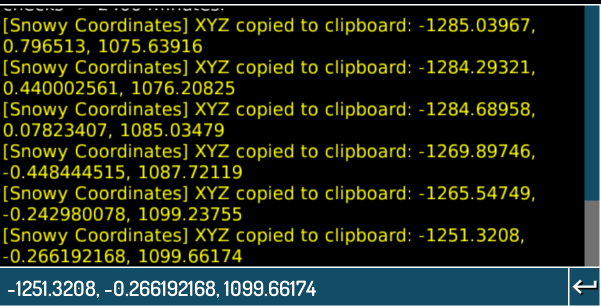

  

  <strong>Snowy Coordinates</strong> is a lightweight mod for <em>My Winter Car</em> that displays your current in-game coordinates in real-time. Perfect for navigation or debugging the map while keeping the game performance-friendly.

---

<h1 align="center">Features</h2>

⚡ <b>Performance friendly</b> – does not impact game performance 
💻 <b>Modern interface</b> – clean and easy-to-read design 
🗺️ <b>Displays current XYZ coordinates</b> – always know your location 
📝 <b>Ability to copy coordinates to clipboard</b> – copy exact coordinates with one click 
👆 <b>Ability to drag the window</b> – move the window anywhere on screen

---

<h1 align="center">Installation</h2>

<strong>You have two ways to install the mod. You can do it through Nexus Mods:</strong>

  

<strong>Or you can do it here, through GitHub:</strong>

1. Download the latest version from <a href="https://github.com/xAwakenDeveloper/SnowyCoordinates/releases">Release</a>.   
2. Install <a href="https://github.com/piotrulos/MSCModLoader">MSCLoader (For My Winter Car)</a>.   
3. Extract the files into your mods folder.   
4. Launch the game and enjoy the mod!

---

<h1 align="center">Preview</h2>

<strong>Here's a preview of how this mod looks in the game:</strong>

  

<strong>Copying coordinates to clipboard:</strong>

  

---

<h1 align="center">Usage & Restrictions</h2>

This mod is for personal use only. Modification, redistribution, or commercial use is strictly prohibited.

---
